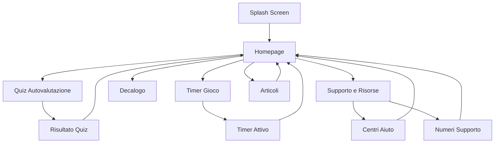

## 1. Panoramica Prodotto

USA TESTA è una Progressive Web App (PWA) dedicata alla sensibilizzazione sul gioco d'azzardo responsabile. L'applicazione fornisce strumenti educativi, test di autovalutazione e risorse di supporto per promuovere un approccio consapevole al gioco.

Il progetto si rivolge a tutti gli utenti maggiorenni interessati a comprendere meglio il proprio rapporto con il gioco d'azzardo e ad accedere a risorse di supporto. L'app offre quiz valutativi, timer per il controllo del tempo di gioco, decaloghi educativi e informazioni su centri di aiuto territoriali.

## 2. Funzionalità Principali

### 2.1 Ruoli Utente

| Ruolo | Metodo Accesso | Permessi Principali |
|-------|----------------|---------------------|
| Utente Maggiorenne | Dichiarazione età via checkbox | Accesso completo a tutte le funzionalità |

### 2.2 Moduli Funzionali

L'applicazione USA TESTA comprende le seguenti pagine principali:

1. **Splash Screen**: schermata iniziale con dichiarazione maggiore età e accettazione privacy policy
2. **Homepage**: punto di accesso con tre card principali (Quiz, Decalogo, Supporto), slider articoli e consigli
3. **Pagina Timer**: selezione tempo e avvio timer per tracciare il tempo di gioco
4. **Pagina Quiz**: autovalutazione tramite 9 domande CPGI/PGSI con animazioni swipe
5. **Pagina Decalogo**: 10 regole per il gioco responsabile
6. **Pagina Informazioni Utili**: risorse, numeri di supporto e download manuale
7. **Pagina Centri Aiuto**: ricerca per regione/comune di centri di supporto
8. **Pagina Articoli**: elenco completo articoli educativi
9. **Pagina Chatbot**: placeholder per assistenza virtuale
10. **Pagina Giochi**: placeholder per contenuti futuri

### 2.3 Dettagli Pagine

| Nome Pagina | Modulo | Descrizione Funzionalità |
|-------------|--------|---------------------------|
| Splash Screen | Logo e Brand | Mostra logo "USA TESTA" con quote "Le responsabilità educano" |
| Splash Screen | Checkbox età | Checkbox per dichiarare maggiore età con link privacy policy |
| Splash Screen | CTA Iniziamo | Bottone abilitato solo dopo accettazione checkbox |
| Homepage | Header | Logo app e navigazione principale |
| Homepage | Card Quiz | Accesso a quiz autovalutazione con immagine banner |
| Homepage | Card Decalogo | Accesso a decalogo giocatore responsabile |
| Homepage | Card Supporto | Accesso a informazioni e risorse utili |
| Homepage | Slider Articoli | Carosello orizzontale con 4 articoli da array statico |
| Homepage | CTA Leggi Tutti | Link a pagina completa articoli |
| Homepage | Consigli | Card stacking con gradienti animati e 8 suggerimenti |
| Homepage | Bottom Navigation | 5 icone: Home, Articoli, Timer, Supporto, Profilo |
| Timer | Seleziona Tempo | Input per durata sessione con opzioni predefinite |
| Timer | Storico Timer | Mostra timer recenti salvati in localStorage |
| Timer | Avvia Timer | Bottone per iniziare conteggio con timestamp |
| Timer | Stato Timer | Visualizza tempo rimanente e stato attivo/pausa |
| Timer | Gestione LocalStorage | Salva/ricarica stato timer anche dopo chiusura app |
| Quiz | Card Domanda | Presenta domanda con immagine e 4 opzioni risposta |
| Quiz | Animazione Swipe | Effetto Tinder per risposte positive/negative |
| Quiz | Progresso | Mostra domanda corrente/totale |
| Quiz | Riepilogo Risposte | Visualizza tutte le risposte prima invio |
| Quiz | Modifica Risposte | Permette di cambiare risposte prima invio |
| Quiz | Calcolo Punteggio | Interpreta risultati CPGI/PGSI (0-27 punti) |
| Quiz | Risultato Finale | Mostra livello rischio: nessuno, basso, moderato, problematico |
| Decalogo | Header Pagina | Titolo "Il decalogo del giocatore" con back button |
| Decalogo | Lista 10 Regole | Card con testo e numerazione sfumata (01-10) |
| Informazioni Utili | Banner Download | CTA per scaricare manuale PDF |
| Informazioni Utili | Numeri Supporto | Due card con numeri telefonici di aiuto |
| Informazioni Utili | Numero Verde | Immagine numero verde nazionale |
| Informazioni Utili | CTA Centri Aiuto | Banner per accesso pagina ricerca centri |
| Centri Aiuto | Input Ricerca | Campi regione e comune con autocomplete |
| Centri Aiuto | Lista Risultati | Card con dati centri da file JSON statico |
| Articoli | Griglia Articoli | Layout responsive con tutti gli articoli disponibili |

## 3. Flussi Principali

### Flusso Utente Maggiorenne

1. **Accesso Iniziale**: Utente apre app → Visualizza splash screen → Dichiara maggiore età → Accede a homepage
2. **Quiz Autovalutazione**: Homepage → Clicca card Quiz → Risponde a 9 domande → Visualizza risultato → Ritorna homepage
3. **Timer Gioco**: Homepage → Clicca timer → Seleziona durata → Avvia timer → Gestisce sessione → Salva dati
4. **Ricerca Supporto**: Homepage → Clicca supporto → Visualizza risorse → Cerca centri → Contatta numeri utili
5. **Educazione**: Homepage → Clicca decalogo → Legge 10 regole → Applica consigli

## 4. Interfaccia Utente

### 4.1 Stile Design

- **Colori Principali**: Blu navy scuro (primary-blue), Blu chiaro (primary-light-blue), Arancione (secondary-orange), Bordeaux (secondary-bordeaux)
- **Colori Tertiari**: Ocra, Petrolio, Verde, Viola con varianti al 20-80%
- **Typography**: Font Lato per tutti i testi
  - H1: 28px bold
  - H2: 24px bold  
  - H3: 20px bold
  - Body: 16px regular
  - Small: 12px regular
- **Bottoni**: Stile rounded rectangle con sfumature gradient
- **Layout**: Card-based con ombreggiature leggere
- **Animazioni**: Swipe per quiz, stacking scroll per consigli, gradienti animati

### 4.2 Dettagli Pagine UI

| Pagina | Elemento | Specifiche UI |
|--------|----------|---------------|
| Splash | Logo | "USA TESTA" maiuscolo, "LA" rossa integrata, triangolo navy |
| Splash | Checkbox | Bordo navy, check mark bianco su navy |
| Homepage | Card principali | Gradienti navy-blue, immagini illustrative |
| Homepage | Slider articoli | Carosello orizzontale, 4 card visibili |
| Homepage | Consigli | Card stacking, gradienti magenta-blue con animazione |
| Timer | Display tempo | Font 96px bold per timer attivo |
| Timer | Card storico | Layout griglia con timer recenti |
| Quiz | Card domanda | Sfondo bianco, bordi arrotondati, immagine header |
| Quiz | Opzioni | 4 bottoni colorati per risposte |
| Decalogo | Card regola | Numerazione grande sfumata (01-10), testo nero |
| Supporto | Card numeri | Design prominente con colori di attenzione |

### 4.3 Responsive Design

- **Mobile-First**: Design ottimizzato per smartphone (320px+)
- **Adattabilità**: Layout fluido fino a tablet (768px)
- **Touch Optimization**: Bottoni min 44px, spaziature adeguate
- **PWA**: Installabile su iOS/Android con manifest.json

### 4.4 Icone e Immagini

- Icone app: Stile linea sottile, colori navy/blue
- Immagini quiz: Illustrazioni stile paper con pennellate blue
- Banner: Design coerente con palette colori Figma
- Logo: Versioni SVG per tutte le risoluzioni