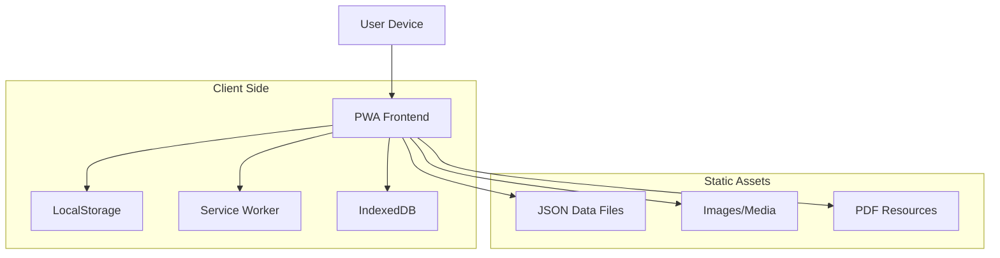

## 1. Architettura Sistema



## 2. Stack Tecnologico

- **Frontend**: React@18 + TypeScript@5 + Vite@5
- **Initialization Tool**: vite-init
- **Styling**: TailwindCSS@3 + CSS Modules
- **State Management**: React Context + useReducer
- **Routing**: React Router@6
- **PWA**: Vite PWA Plugin + Workbox
- **Storage**: LocalStorage + IndexedDB
- **Build**: Vite con target ES2020
- **Backend**: None (completamente client-side)

## 3. Definizione Rotte

| Route | Scopo |
|-------|--------|
| / | Splash screen con accettazione maggiore età |
| /home | Homepage principale con accesso funzionalità |
| /quiz | Quiz autovalutazione CPGI/PGSI |
| /quiz/result | Risultato quiz con interpretazione punteggio |
| /timer | Timer per tracciare tempo di gioco |
| /decalogo | 10 regole gioco responsabile |
| /support | Informazioni utili e risorse |
| /support/centers | Ricerca centri di aiuto per regione/comune |
| /articles | Lista completa articoli educativi |
| /chatbot | Placeholder assistenza virtuale |
| /games | Placeholder giochi educativi |

## 4. Struttura Componenti

### 4.1 Componenti Core

```typescript
// Componente Timer
interface TimerState {
  duration: number; // in minutes
  timeRemaining: number; // in seconds  
  isActive: boolean;
  isPaused: boolean;
  startTime: number; // timestamp
  endTime: number; // timestamp
}

interface TimerHistory {
  id: string;
  duration: number;
  completedAt: number;
  wasCompleted: boolean;
}

// Componente Quiz
interface QuizQuestion {
  id: number;
  text: string;
  image?: string;
}

interface QuizAnswer {
  questionId: number;
  value: 0 | 1 | 2 | 3; // Mai | A volte | Spesso | Quasi sempre
}

interface QuizResult {
  totalScore: number;
  riskLevel: 'none' | 'low' | 'moderate' | 'problematic';
  answers: QuizAnswer[];
}

// Componente Centers
interface HelpCenter {
  id: string;
  name: string;
  region: string;
  province: string;
  city: string;
  address: string;
  phone?: string;
  email?: string;
  website?: string;
  services: string[];
}
```

### 4.2 Servizi LocalStorage

```typescript
// Storage Keys
const STORAGE_KEYS = {
  USER_CONSENT: 'usalatesta_user_consent',
  TIMER_STATE: 'usalatesta_timer_state',
  TIMER_HISTORY: 'usalatesta_timer_history',
  QUIZ_RESULTS: 'usalatesta_quiz_results',
  APP_PREFERENCES: 'usalatesta_preferences'
} as const;

// Timer Service
class TimerService {
  saveTimerState(state: TimerState): void
  loadTimerState(): TimerState | null
  addToHistory(history: TimerHistory): void
  getHistory(): TimerHistory[]
  clearHistory(): void
}

// Quiz Service  
class QuizService {
  saveQuizResult(result: QuizResult): void
  getQuizResults(): QuizResult[]
  getLastQuizResult(): QuizResult | null
  clearQuizData(): void
}
```

## 5. Gestione Dati Statici

### 5.1 Strutture Dati JSON

```typescript
// Quiz Questions (statico)
const QUIZ_QUESTIONS: QuizQuestion[] = [
  {
    id: 1,
    text: "Hai puntato più denaro di quanto potessi permetterti di perdere?",
    image: "/images/quiz/question1.jpg"
  },
  // ... altre 8 domande
];

// Articles (statico)
interface Article {
  id: string;
  title: string;
  excerpt: string;
  content: string;
  image: string;
  category: string;
  readTime: number;
}

// Help Centers - loaded da C_17_bancheDati_32_0_0_file.json
interface CentersData {
  centers: HelpCenter[];
  lastUpdate: string;
}
```

### 5.2 IndexedDB per Dati Grandi

```typescript
// Configurazione IndexedDB per cache dati
const DB_CONFIG = {
  name: 'UsalaTestaDB',
  version: 1,
  stores: {
    CENTERS: 'help_centers',
    ARTICLES: 'articles',
    RESOURCES: 'resources'
  }
};
```

## 6. PWA Configuration

### 6.1 Manifest.json

```json
{
  "name": "USA TESTA - Gioco Responsabile",
  "short_name": "USA TESTA",
  "description": "App per la sensibilizzazione sul gioco d'azzardo responsabile",
  "start_url": "/",
  "display": "standalone",
  "background_color": "#ffffff",
  "theme_color": "#1e3a8a",
  "orientation": "portrait",
  "icons": [
    {
      "src": "/icons/icon-192x192.png",
      "sizes": "192x192",
      "type": "image/png"
    },
    {
      "src": "/icons/icon-512x512.png", 
      "sizes": "512x512",
      "type": "image/png"
    }
  ]
}
```

### 6.2 Service Worker Strategy

- **Cache First**: per assets statici (immagini, CSS, JS)
- **Network First**: per dati JSON dei centri (con fallback a cache)
- **Stale While Revalidate**: per contenuti articoli
- **Offline Support**: per timer e quiz in corso

## 7. Performance Optimization

### 7.1 Code Splitting

- Route-based splitting per ogni pagina principale
- Component lazy loading per modali e sezioni secondarie
- Dynamic imports per JSON data files

### 7.2 Asset Optimization

- Image optimization: WebP con fallback JPEG
- Responsive images con srcset
- SVG per icone e illustrazioni
- Font subsetting per Lato (solo caratteri necessari)

### 7.3 Bundle Size Targets

- Initial bundle: < 200KB gzipped
- Total app size: < 1MB
- Time to Interactive: < 3s su 3G

## 8. Testing Strategy

### 8.1 Unit Testing
- React Testing Library per componenti
- Jest per logica business
- Coverage target: > 80%

### 8.2 Integration Testing
- Cypress per flussi principali (quiz, timer)
- PWA functionality testing
- Cross-browser compatibility

### 8.3 Performance Testing
- Lighthouse CI per PWA score
- WebPageTest per performance reali
- Bundle analysis con webpack-bundle-analyzer

## 9. Deployment

### 9.1 Build Process
```bash
npm run build        # Produzione ottimizzata
npm run build:analyze # Analisi bundle
npm run preview      # Preview build locale
```

### 9.2 Hosting Requirements
- HTTPS required per PWA
- Static file hosting (Netlify, Vercel, S3+CloudFront)
- Custom domain support
- SPA routing configuration

### 9.3 Monitoring
- Error tracking con Sentry (opzionale)
- Analytics con privacy-first solution
- Performance monitoring